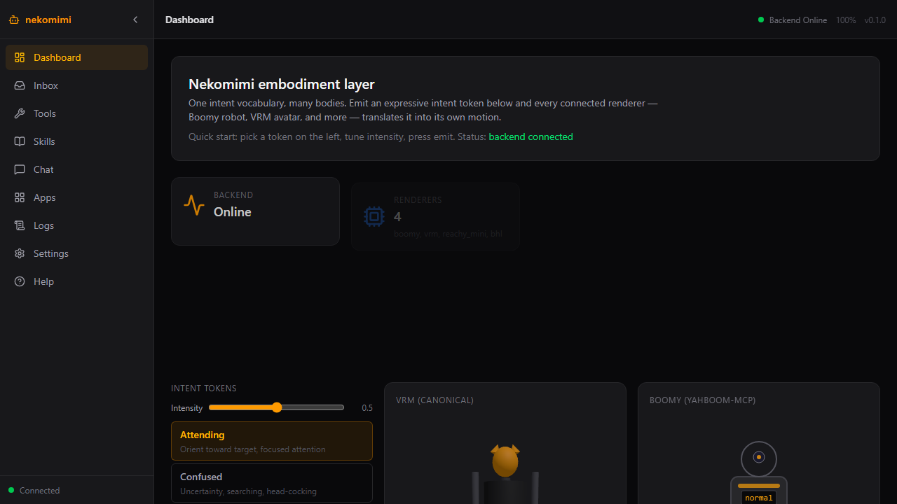
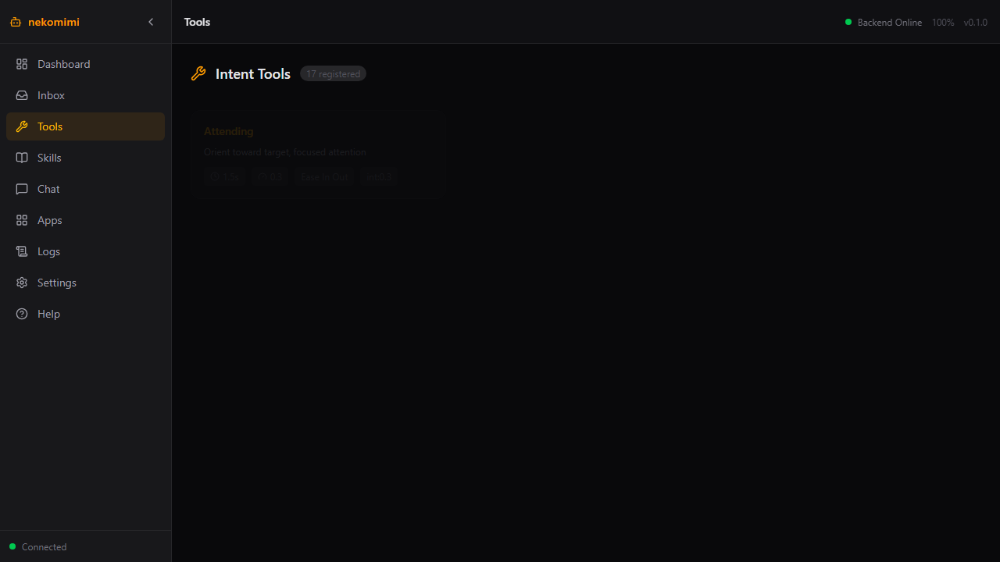

# nekomimi-mcp

   

Substrate-independent embodiment layer for conversational NPCs — one intent vocabulary, many bodies.

## Preview

| Dashboard | Intent tools |
|-----------|--------------|
|  |  |
| Live KPIs, intent panel, VRM + Boomy previews | All 17 intent tokens with timing metadata |

## What You Can Do

**How it runs**: headless by default — `express_intent` works with no hardware (simulated renderers + SQLite recording). Connect a Boomy robot via yahboom-mcp or a local LLM for full chat; nothing is bundled.

- Emit 17 expressive intent tokens across 4 body types from one call
- Chain intents into streams, record them, replay without hardware
- Chat skill-first: operator skill + your local LLM, offline fallback included
- Safety-guarded retreat (LIDAR) with auto-timeout persistent intents
- Dashboard, Inbox (recordings), Apps (fleet discovery), Chat, Logs, Settings

## Quick Install

Drag-and-drop `dist/nekomimi-mcp-v0.1.0.mcpb` into Claude Desktop, or:

```powershell
uv sync
just serve-http   # backend :11128
```

Full paths: [INSTALL.md](INSTALL.md). First time? Read [docs/ONBOARDING.md](docs/ONBOARDING.md) before expecting live chat.

## Example Prompts

- "Express a surprised gesture, then curiosity, then attention"
- "What can the Boomy robot express, and what are its limits?"
- "Replay recording 3 on the VRM renderer only"

## Fleet Crossconnects (Companions)

| Peer | Role | Optional? |
|------|------|-----------|
| [yahboom-mcp](https://github.com/sandraschi/yahboom-mcp) | Boomy robot hardware bridge (:10892) | Yes — sim mode without it |
| [resonite-mcp](https://github.com/sandraschi/resonite-mcp) | Resonite VRM avatar bridge (:10979) | Yes — preview works without it |

Companions are probed live on the Apps page and never required.

## Documentation

| Doc | Contents |
|-----|----------|
| [Installation](INSTALL.md) | All install methods, prerequisites |
| [Onboarding](docs/ONBOARDING.md) | First-timer setup, money/CC (none), pitfalls |
| [Architecture](docs/ARCHITECTURE.md) | System architecture, data flow, ports |
| [Configuration](docs/CONFIGURATION.md) | Env vars, config options |
| [Tool Reference](docs/TOOLS.md) | All 14 MCP tools + prompts + resources |
| [Development](docs/DEVELOPMENT.md) | Contributing, local setup, test doubles |
| [Troubleshooting](docs/TROUBLESHOOTING.md) | Common issues |

## Requirements

Windows 10/11, Python 3.12+ (via `uv`), optional: Ollama or LM Studio for chat,
Boomy robot + yahboom-mcp for hardware expression. Ports 11128/11129 must be free.

## License

MIT — see [LICENSE](LICENSE).
